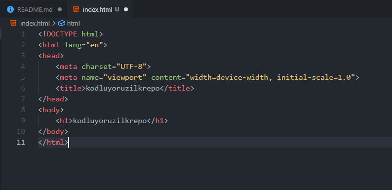

# Kodluyoruz Ilk Repo

Bu repo [Kodluyoruz](https://www.kodluyoruz.org) Front-End Eğitiminde oluşturduğumuz ilk repo. İçerisinde bir adet README dosyası, bir adet de index.html barındırıyor.


## Installation

Öncelikle projeyi clonelayın. 

HTTPS
```bash
git clone https://github.com/BGursoyy/kodluyoruzilkrepo
```
SSH
```bash
git clone git@github.com:BGursoyy/kodluyoruzilkrepo.git
```
<sub>SSH ile githuba baglanmak icin [dokumantasyonu](https://docs.github.com/en/authentication/connecting-to-github-with-ssh/generating-a-new-ssh-key-and-adding-it-to-the-ssh-agent) takip edebilirsiniz</sub>
## Usage

Projeyi cloneladıktan sonra Visual Studio Code programında açınız.


```bash
cd kodluyoruzilkrepo
code .
```

## Contributing
Pull requestler kabul edilir. Büyük değişiklikler için, lütfen önce neyi değiştirmek istediğinizi tartışmak için bir konu açınız.


## License
[MIT](./LICENSE)